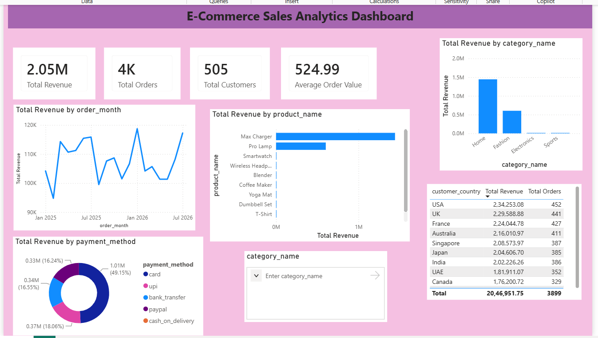

# E-Commerce Sales Analytics Database

## Dashboard Preview

## Overview
This project demonstrates advanced SQL skills by designing a fully normalized relational database for an e-commerce platform. It models real-world business operations (customers, products, orders, shipments, and reviews) and answers complex analytical questions using advanced SQL techniques.

## Tech Stack
- **Database:** PostgreSQL
- **Tools:** pgAdmin 4, Notepad++ / VS Code
- **Languages:** Advanced SQL

## Database Schema
The database consists of 8 normalized tables:
- `categories`
- `customers`
- `products`
- `orders`
- `order_items`
- `payments`
- `reviews`
- `shipments`

## Dataset Size
- **Customers:** ~500+
- **Products:** ~50+
- **Orders:** 5,000+
- **Order Items:** 10,000+
- *Generated natively in PostgreSQL using `generate_series()` and `random()`.*

## Key SQL Concepts Demonstrated
- **Database Design:** Normalization, Primary/Foreign Keys, Constraints, Indexes
- **Advanced Queries:** Common Table Expressions (CTEs), Window Functions (`LAG`, `RANK`), Subqueries
- **Business Metrics:** Revenue tracking, Average Order Value (AOV), Customer Lifetime Value (CLV)
- **Customer Analytics:** Cohort Analysis, Repeat Purchase Rate, RFM Segmentation (Recency, Frequency, Monetary)
- **Performance Optimization:** Indexing and Views for faster reporting

## How to Run This Project Locally
1. Install PostgreSQL and pgAdmin.
2. Create a new database named `ecommerce_analytics`.
3. Run `schema.sql` to create the tables and views.
4. Run `seed_data.sql` to insert the initial sample data.
5. Run `generate_big_data.sql` to populate the database with 10,000+ realistic rows.
6. Open `queries/business_queries.sql` and run the analytics queries one by one!

## Example Business Questions Answered
1. What is our month-over-month revenue growth?
2. Which products and categories drive the most revenue?
3. What is the average order value (AOV)?
4. What percentage of our customers are repeat buyers?
5. Which customer segments are "Champions" vs "At Risk" (RFM Analysis)?
